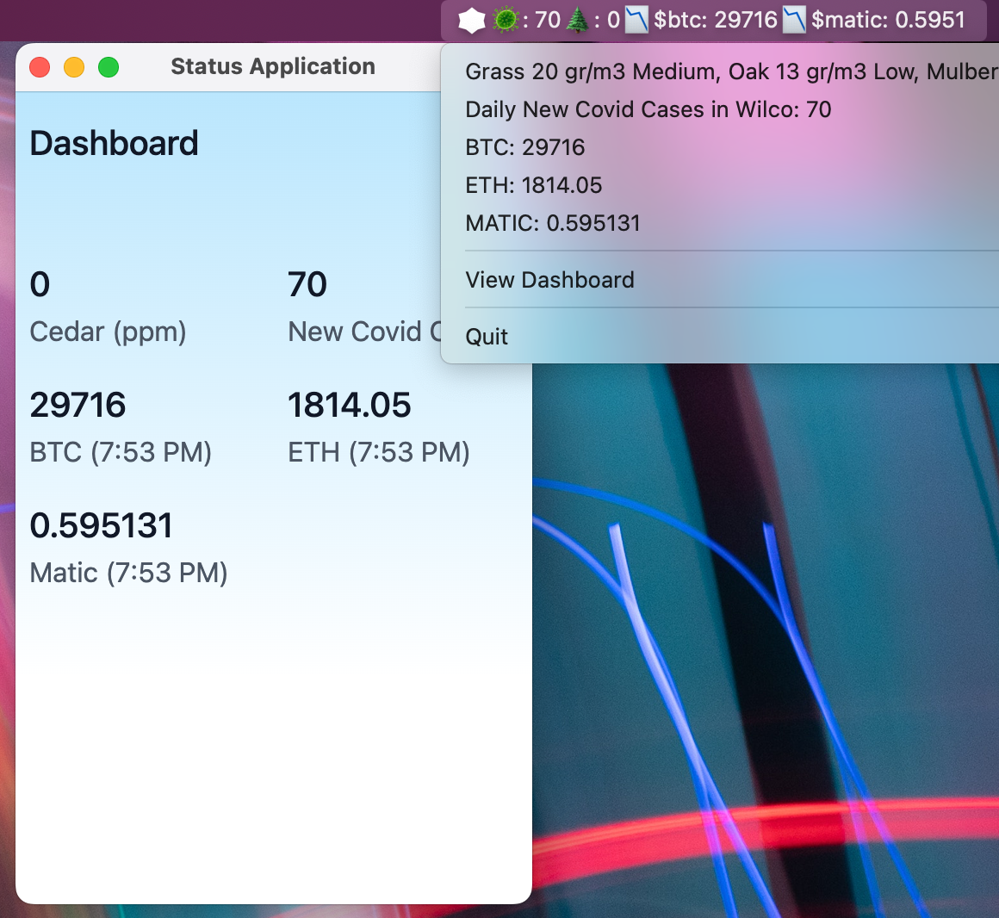

# Status Bar Application

This is a personal project I wrote to display a few bits of data in my Mac's desktop status/title bar
area. The application is written with Javascript/Typescript using electron via the `electron-forge`
framework along with TailWindCSS and React.js for the window UI. Clicking any of the entries in the
status bar's dropdown menu opens your browser to the data's source web page for more inspection.

## Information Collected

The app is hardcoded to display a few personally relevant bits of information, which probably won't
appeal to anyone else specifically. They are:

- Daily new covid cases in Williamson County, Texas
- Any recorded cedar pollen (useful Dec-Feb) in the air in Austin, TX
- Crypto quotes for BTC, ETH, and MATIC

## Interesting Technology Aspects

From the tech perspective, this project demonstrates a few unique things that are harder to find examples of online.

1. Because some of the data is web scraped from dynamic websites, we can't just
   use a standard web page fetch to get this data. Instead we use a headless
   version of Chrome via the Puppeteer framework to instantiate a hidden browser
   that navigates through a few pages of data if necessary to get the information
   we need. Currently the county covid data and the allergy/pollen reports use this
   browser approach because both sites rely heavily on dynamic javascript.

1. The bulk of the data collection is done in the main Electron process, which
   is generally frowned upon for the simple fact that if you code this poorly, and
   it blocks this main process, any child view renderer processes are also blocked.
   A _LOT_ of Electron examples therefore suggest and show you how to put this
   logic into your renderer processes. However, for our case, we needed to run
   Puppeteer, and update not just the one window view, but also the status bar
   icons and drop down menus. Running the data collection logic in the main process
   was therefore best positioned to collect the data and then emit event updates to
   the various UI pieces that needed it.

## Getting Started

Install all the dependencies. Puppeteer does prefer to make use of a local Chromium install. If issues arise with that at any point in the getting started, it's best to consult the puppeteer project.

> $ yarn

Create the executable. The executable will e

> $ yarn make

If all goes well with the `make` command, you'll have a Mac excecutable in the directory `out/Status Bar App-ARCHITECTURE`, where the ARCHITECTURE is the specific architecture of your computer. An example would be `out/Status Bar App-darwin-arm64`. Within that folder, you'll find the actual application called `Status Bar App`.

Go ahead and test the application. If it works, you can manually copy it elsewhere to use or package it for distribution.

## Looking Ahead

This is admittedly a very quick and simple application. There are a number of things that would be nice to add.

- Change the crypto api away from CoinGecko to something that provides more frequent price updates. This app can poll the crypto api as often as it likes, but CoinGecko lags the market just enough that it's not always up to date for the exact second.

- Better use of Window to manage adding/removing cryptos to display.

- Use of desktop notification if any of the values cross predetermined values. This could be useful for any data displayed here.
